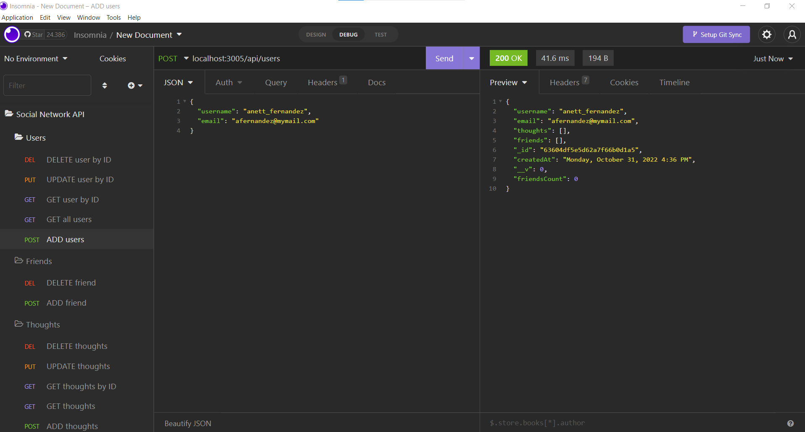
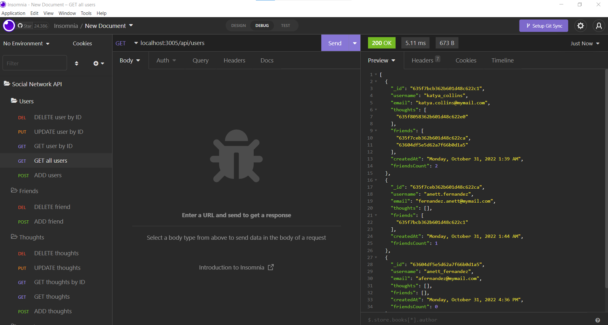
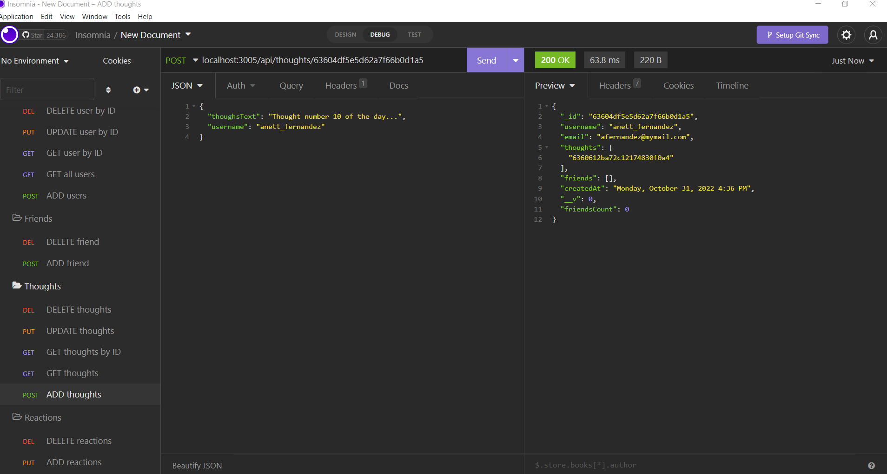
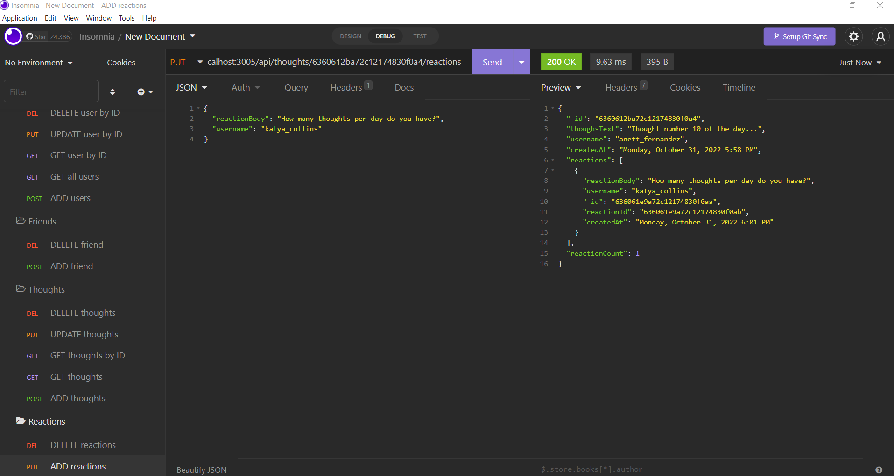
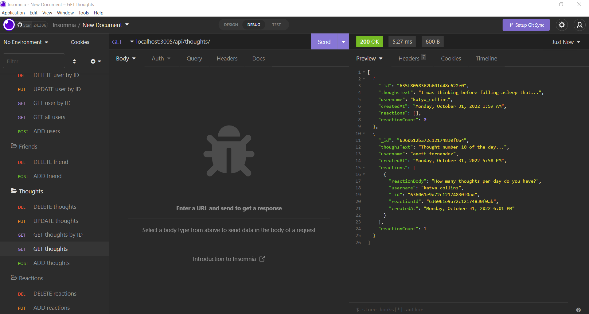
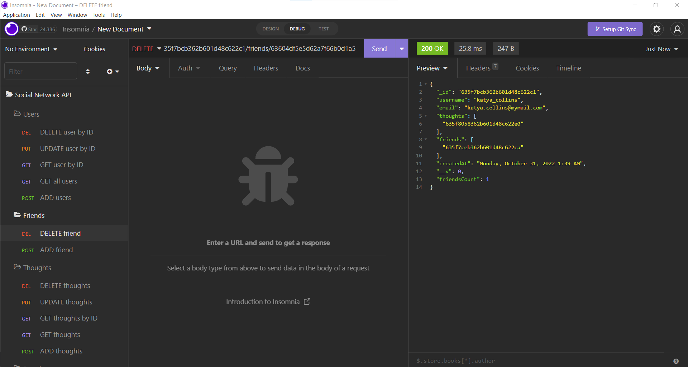

# Social Network API

## Table of Contents

- [Project Description](#Project-Description)
- [User Story](#User-Story)
- [Usage](#Usage)
- [Screen Captures](#Screen-Captures)
- [Technologies](#Technologies)
- [Questions](#Questions)
- [Links](#Links)
- [License](#License)


## Project Description

An API for a Social Network web application where users can share their thoughts, react to friends’ thoughts, and create a friend list. This application constitutes the backend area of the social network project by connecting a series of user queries with the server and the database.

Using JavaScript, Express.js, MongoDB and Mongoose ODM, this app allows the user to create a username that is linked to a unique email address. The user can see a list of all the users, update, see and delete a user by ID, and add and delete friends that belong to the social network. Furthermore, the user can create thoughts in the form of posts, and update, see and delete them. Finally, the user can add reactions to other users' thoughts, and also delete them.

###### [Back to Index](#Table-of-Contents)


## User Story

```
AS A social media startup
I WANT an API for my social network that uses a NoSQL database
SO THAT my website can handle large amounts of unstructured data
```
###### [Back to Index](#Table-of-Contents)

## Usage
To run the Social Network API, the user must have Node.js, MongoDB and Insomnia installed on the computer. In addition, Express.js, Mongoose, Moment.js must be installed in the directory of the project. Once the repo has been cloned, in the command line run the following commands:

```
$ npm init
$ npm install express
$ npm install mongoose --save 
$ npm install moment
```

To start the application run the following command:

```
$ node index
```
Finally, once the server is running, it is necessary to use Insomnia to execute the different queries. To get the complete list of routes and queries that can be run please refer to the user-routes.js and thoughts-routes.js files.

###### [Back to Index](#Table-of-Contents)

## Screen Captures












###### [Back to Index](#Table-of-Contents)

## Technologies


###### [Back to Index](#Table-of-Contents)

## Questions
Please, feel free to get in touch to discuss any inquiries or suggestions about the project. I will be happy to connect with you!
###### [Back to Index](#Table-of-Contents)

## Links
- [Application Repository](https://github.com/AlexJCturbo/social_network_api)
- [Walkthrough Video]()
###### [Back to Index](#Table-of-Contents)


## License
MIT License

Copyright (c) 2022 Alejandro Jaimes

Permission is hereby granted, free of charge, to any person obtaining a copy of this software and associated documentation files (the "Software"), to deal in the Software without restriction, including without limitation the rights to use copy, modify, merge, publish, distribute, sublicense, and/or sell copies of the Software, and to permit persons to whom the Software is furnished to do so, subject to the following conditions:

The above copyright notice and this permission notice shall be included in all copies or substantial portions of the Software.

THE SOFTWARE IS PROVIDED "AS IS", WITHOUT WARRANTY OF ANY KIND, EXPRESS OR IMPLIED, INCLUDING BUT NOT LIMITED TO THE WARRANTIES OF MERCHANTABILITY, FITNESS FOR A PARTICULAR PURPOSE AND NONINFRINGEMENT. IN NO EVENT SHALL THE AUTHORS OR COPYRIGHT HOLDERS BE LIABLE FOR ANY CLAIM, DAMAGES OR OTHER LIABILITY, WHETHER IN AN ACTION OF CONTRACT, TORT OR OTHERWISE, ARISING FROM, OUT OF OR IN CONNECTION WITH THE SOFTWARE OR THE USE OR OTHER DEALINGS IN THE SOFTWARE.
###### [Back to Index](#Table-of-Contents)